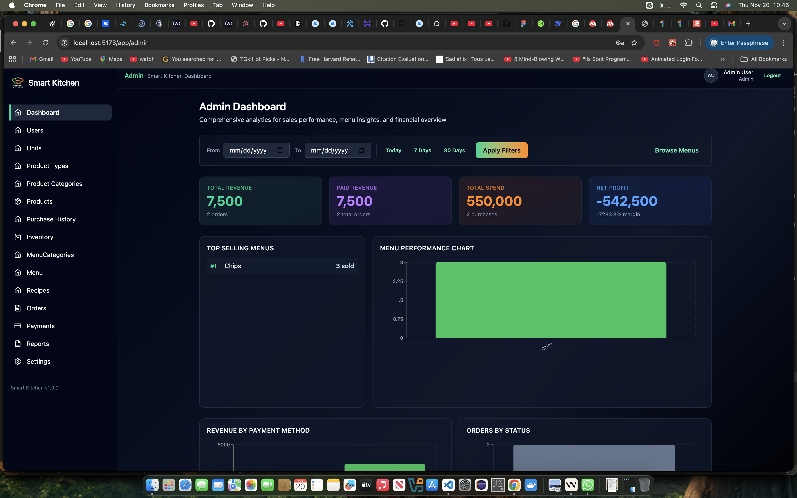
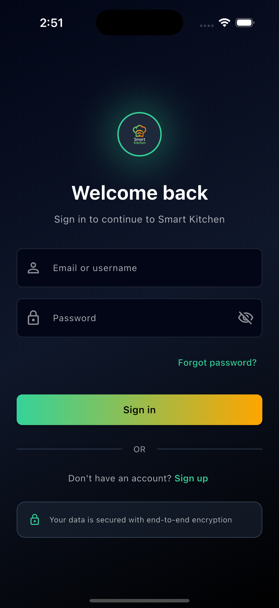
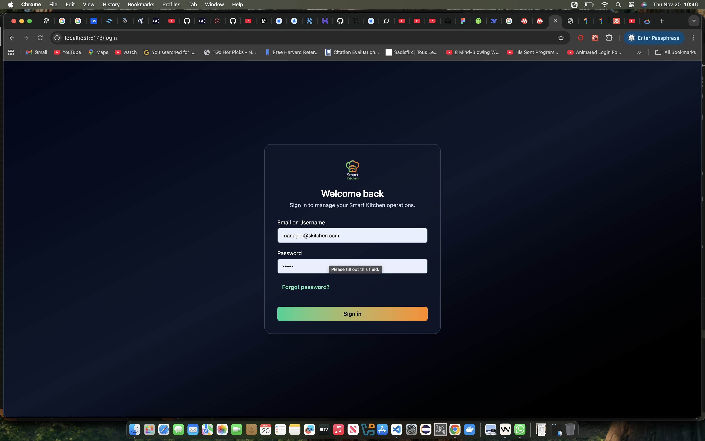
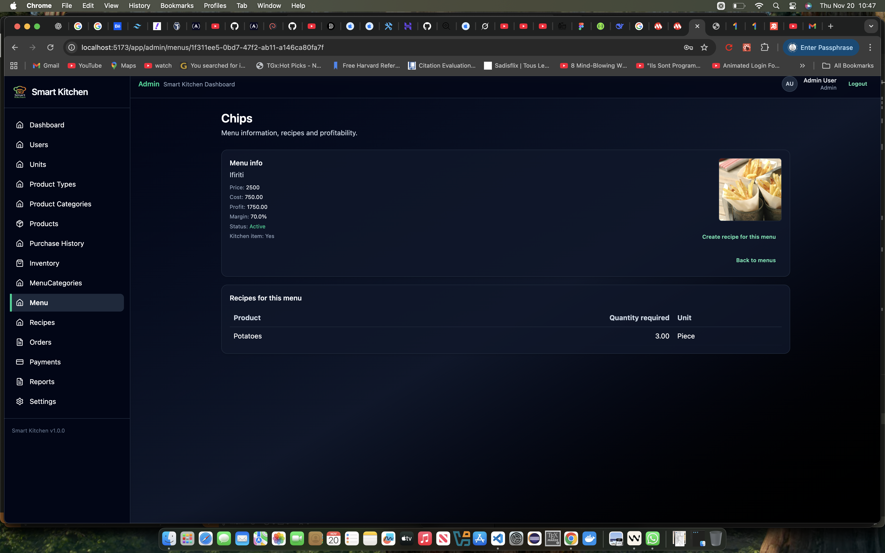
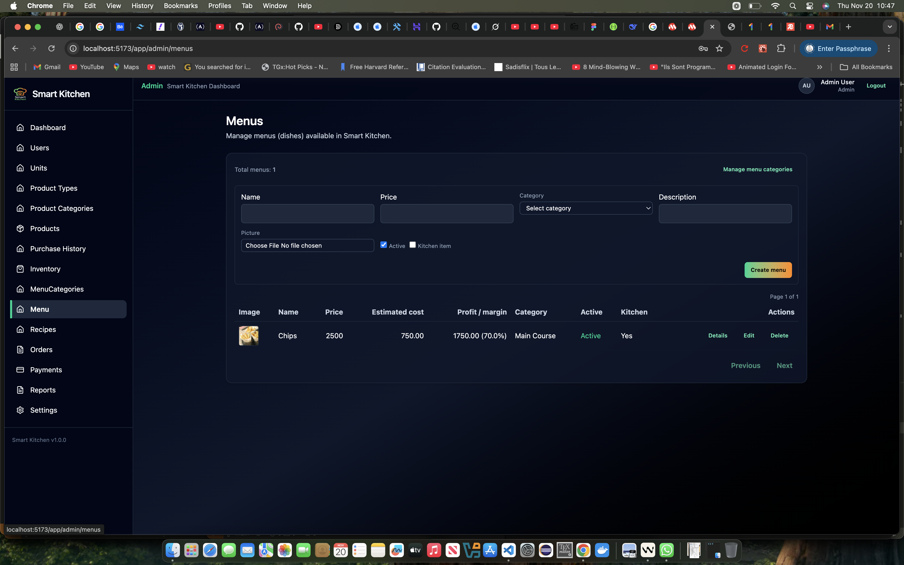
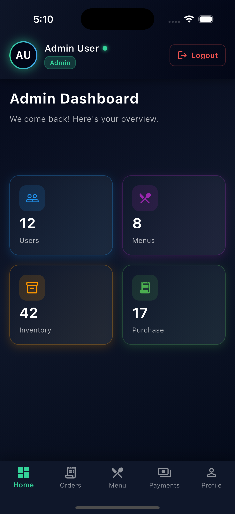
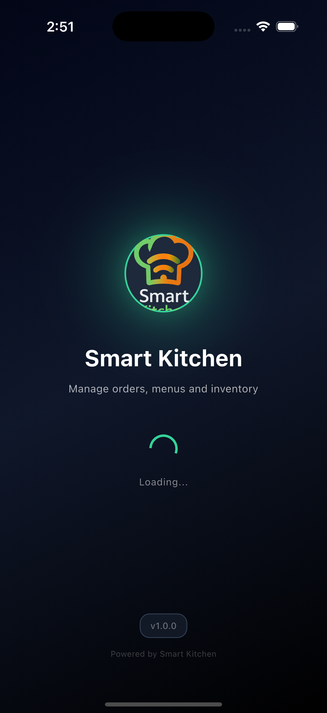
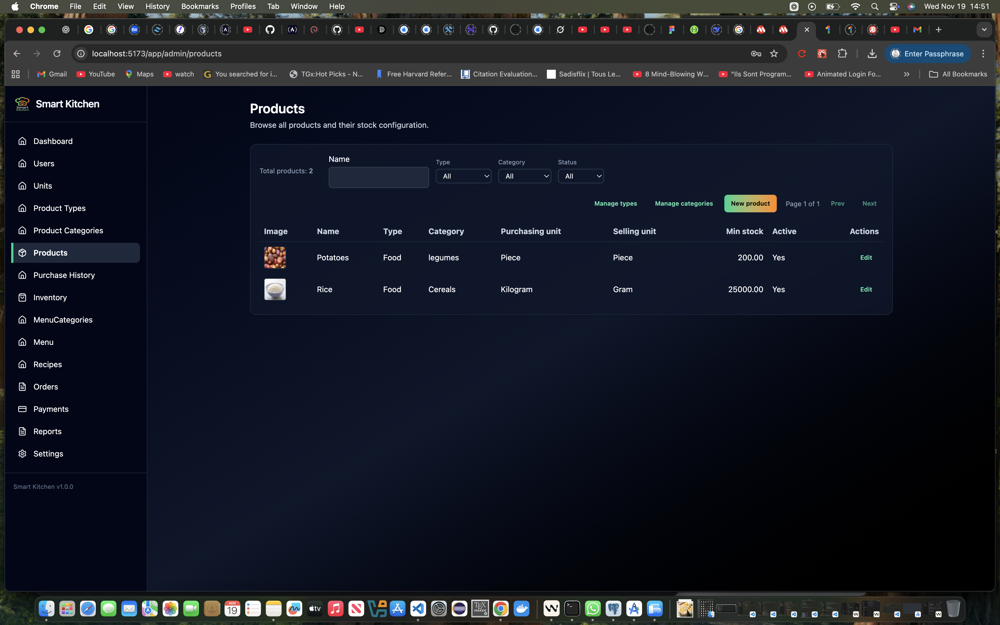
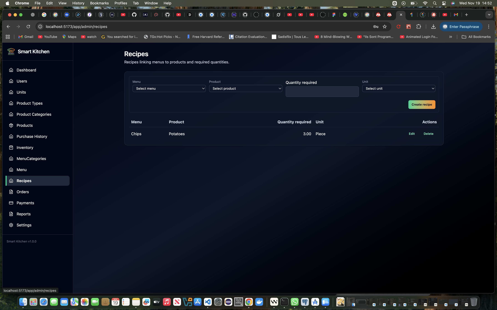
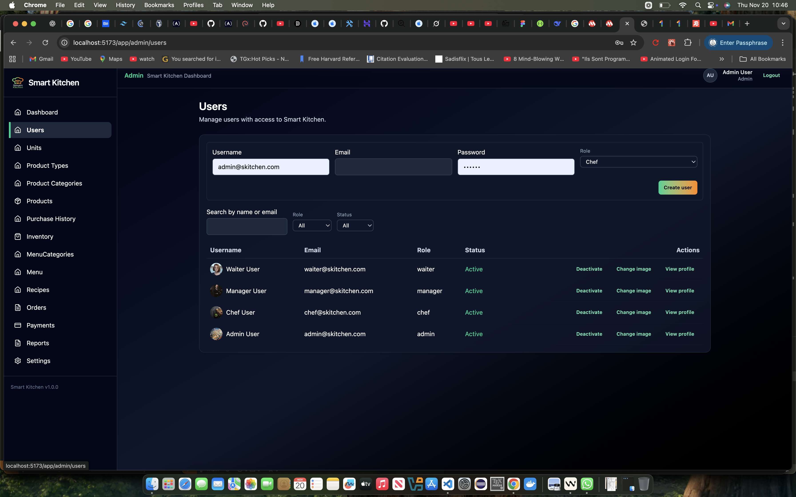

# Smart Kitchen

**Smart Kitchen** is a full-stack web application designed to streamline kitchen operations, menu management, inventory tracking, order processing, and staff workflow. It provides role-based access control for different staff members (Admin, Chef, Manager, Waiter) and supports real-time order and inventory management.

This repository contains both the backend (`skitchen_backend`) and frontend (`skitchen_frontend`) of the application, along with documentation to help developers set up, use, and extend the system.

---

## Table of Contents

* [Features](#features)
* [Repository Structure](#repository-structure)
* [Technologies](#technologies)
* [Installation](#installation)
* [Backend Setup](#backend-setup)
* [Frontend Setup](#frontend-setup)
* [Seeding the Database](#seeding-the-database)
* [Running the Application](#running-the-application)
* [Inventory, Recipes & Cost Flow](#inventory-recipes--cost-flow)
* [Role-Based UI Overview](#role-based-ui-overview)
* [API Documentation](#api-documentation)
* [Database Schema](#database-schema)
* [Contributing](#contributing)
* [License](#license)

---

## Features

* **User Management**: Role-based access for Admin, Chef, Manager, and Waiter.
* **Product & Inventory Management**: Track products, units, categories, purchase history, and current stock.
* **Menu & Recipes**: Create menu items, define recipes, and link ingredients to inventory.
* **Orders & Payments**: Manage orders from creation to completion with detailed order items and payment tracking.
* **Seeding & Syncing**: Preloaded sample data for rapid development/testing.
* **Documentation**: API and database schema included for developers.

---

## Screenshots

You can showcase the application UI here. Replace the placeholder paths with real image files from the `screenshort/` or another folder.












---

## Repository Structure

```
smart_kitchen/
│
├─ skitchen_backend/       # Backend server
│  ├─ src/
│  │  ├─ models/           # Sequelize models and relationships
│  │  ├─ controllers/      # Business logic
│  │  ├─ routes/           # Express routes
│  │  ├─ config/           # Database and environment configs
│  │  └─ middlewares/      # Authentication, authorization
│  ├─ seeds/               # Seed files for initial data
│  ├─ server.js            # Backend entry point
│  └─ package.json
│
├─ skitchen_frontend/      # Frontend application
│  ├─ src/
│  │  ├─ components/       # Reusable UI components
│  │  ├─ pages/            # Page views
│  │  ├─ services/         # API calls
│  │  └─ App.js            # Frontend entry point
│  └─ package.json
│
├─ mobile_app/             # Flutter mobile application (Android/iOS)
│  ├─ lib/
│  │  ├─ screens/          # Role-based screens (dashboards, orders, menus, profile, payments)
│  │  ├─ widgets/          # Reusable Flutter widgets
│  │  └─ services/         # API client for the backend
│  └─ pubspec.yaml         # Flutter dependencies
│
└─ docs/                   # Documentation
   ├─ API.md               # API reference
   ├─ Database.md          # ER diagrams, schema
   └─ README.md            # Project overview
```

---

## Technologies

**Backend:**

* Node.js, Express.js
* Sequelize ORM, PostgreSQL
* bcrypt for password hashing
* dotenv for environment management

**Frontend:**

* React.js
* React Router
* Axios for API requests
* TailwindCSS / Bootstrap for styling (optional)

---

## Installation

1. Clone the repository:

```bash
git clone https://github.com/andremugabo/smart_kitchen.git
cd smart_kitchen
```

2. Install dependencies for backend and frontend:

```bash
cd skitchen_backend
npm install
cd ../skitchen_frontend
npm install
```

---

## Backend Setup

1. Copy `.env.example` to `.env` and configure your database credentials:

```
DB_HOST=localhost
DB_PORT=5432
DB_USER=your_db_user
DB_PASSWORD=your_db_password
DB_NAME=skitchen_db
```

2. Run migrations and sync models:

```bash
cd skitchen_backend
npm run seed  # Seeds database with sample data
```

---

## Frontend Setup

1. Navigate to frontend:

```bash
cd skitchen_frontend
```

2. Start the development server:

```bash
npm start
```

3. Open your browser at `http://localhost:3000`.

---

## Mobile App (Flutter)

The `mobile_app` folder contains a Flutter application that connects to the same backend API and is designed to be **simple and user-friendly**, with **limited but focused functionality** for all roles:

* **Per-role dashboards** with only the information each user is allowed to see.
* Screens for **Orders**, **Payments**, **Profile**, and **Menus**, with the ability to manage these features at a smaller scope than the full web UI.
* Intentional feature limitations to keep the mobile UX clean, fast, and easy to use on phones/tablets.

### Implemented roles & screens

From the current Flutter code:

* **Auth & shell**
  * `SplashScreen` – initial route (`/splash`), checks auth state.
  * `LoginScreen` – `/login`, authenticates against the backend and stores token, role, user info.
  * `ForgotPasswordScreen`, `OtpScreen`, `ResetPasswordScreen` – password recovery flow.
* **Home / dashboards**
  * `HomeScreen` – `/home`, role-aware main screen:
    * Decodes JWT role (`admin`, `chef`, `manager`, `waiter`, or default) and loads profile.
    * Shows a card-based dashboard with metrics tailored per role:
      * **admin**: Users, Menus, Inventory, Purchase.
      * **chef**: In Kitchen, Pending, Recipes, Low Stock.
      * **waiter**: Open Tables, Active Orders, Bills, Notifications.
      * **manager**: Revenue, Orders Today, Active Menus, Low Stock.
    * Bottom navigation tabs:
      * **Home** – dashboard for the current role.
      * **Orders** – currently a "Coming soon" placeholder.
      * **Menu** – currently a "Coming soon" placeholder.
      * **Payments** – currently a "Coming soon" placeholder.
      * **Profile** – full profile tab (see below).
    * Floating "New Order" button on the **Orders** tab shows a friendly "Create order (coming soon)" message.
* **Profile**
  * `ProfileTabContent` – used inside the Profile tab of `HomeScreen`:
    * Shows avatar, username, role label, active status, member since, last seen.
    * Supports basic info (email) and optional extras like phone, bio.
    * Provides quick actions (e.g. notifications, security) and account settings (change password, language, theme – currently UI only).
    * Includes an **Edit Profile** action that navigates to `EditProfileScreen` (`/edit-profile`).

Overall, the mobile app gives every role a quick dashboard, a clear bottom-nav for **Home / Orders / Menu / Payments / Profile**, and a rich profile experience, while leaving complex order/menu/payment workflows to the web UI for now.

### Running the mobile app

Prerequisites:

* Flutter SDK installed (`flutter --version`)
* Android Studio / Xcode configured for your target platform

Steps:

```bash
cd mobile_app
flutter pub get
flutter run
```

Make sure your backend (`skitchen_backend`) is running and that the mobile app's API base URL matches your backend URL (e.g. `http://10.0.2.2:3000/api` for Android emulator, or `http://localhost:3000/api` for web/desktop).

---

## Seeding the Database

The backend comes with seeders for:

* Units (`Piece`, `Kilogram`, `Gram`, `Liter`, `Milliliter`)
* Product Types (`Food`, `Drink`, `Tobacco`, `Condiment`)
* Menu Categories (`Appetizers`, `Main Course`, `Desserts`, `Beverages`)
* Users (`Admin`, `Chef`, `Manager`, `Waiter`)

Run the seeders with:

```bash
npm run seed
```

---

## Running the Application

**Backend:**

```bash
cd skitchen_backend
npm run dev
```

**Frontend:**

```bash
cd skitchen_frontend
npm start
```

**Access:**

* Frontend: `http://localhost:5173`
* Backend API: `http://localhost:3000/api`

---

## Inventory, Recipes & Cost Flow

This project includes end-to-end inventory and food-cost logic.

### Product purchases → Inventory

* When a **product is purchased** (via `PurchaseHistory`):
  * The backend records the purchase in `PurchaseHistory`.
  * Inventory is updated using `incrementInventory(product_id, quantity)`:
    * If no inventory row exists for the product, it is **created**.
    * If it exists, `quantity_available` is **incremented**.

### Menus, recipes & estimated cost

* Each **Menu** has one or more **Recipe** rows:
  * `Recipe(menu_id, product_id, quantity_required, unit_id)`.
  * Recipes link menu items to underlying products and units.
* Menu **estimated cost** is calculated by `calculateMenuCost(menuId)`:
  * For each recipe line, the backend:
    * Reads the last `PurchaseHistory` for that `product_id`.
    * Uses `Product.conversion_factor` to convert purchasing units (e.g. kg) to recipe units (e.g. g).
    * Multiplies by `quantity_required`.
  * The total of all recipe-line costs is written into `Menu.estimated_cost`.

### Orders → Inventory deduction

* When an **order is created**:
  * The backend creates `Order` and `OrderDetail` rows.
  * For each ordered menu:
    * All recipes for that `menu_id` are loaded with their `Product` records.
    * For each recipe line:
      * Required quantity = `recipe.quantity_required * ordered_menu_quantity`.
      * `Product.conversion_factor` is used to convert this to inventory units.
      * The backend calls `decrementInventory(product.id, required_inventory_quantity)`.
    * If inventory is insufficient or missing, the order transaction is **rolled back** and the API responds with an error such as `Insufficient inventory for product X`.

This ensures that stock levels track both purchases and menu sales, with unit conversion support.

---

## Role-Based UI Overview

The frontend exposes different views depending on the logged-in role.

### Admin

* **Dashboards**
  * `/app/admin` – overview of sales, menu performance, and purchases, with charts.
* **Menus & Recipes**
  * `/app/admin/menus` – manage menus.
  * `/app/admin/menus/:id` – menu details, recipes, and profitability (price, cost, margin).
  * `/app/admin/recipes` – manage menu recipes.
* **Inventory & Purchases**
  * `/app/admin/inventory` – full inventory view with the ability to set/increase/decrease stock.
  * `/app/admin/purchase-history` – product purchase history.

### Manager

* **Dashboard**
  * `/app/manager` – summary of sales and purchases with charts.
* **Inventory & Recipes**
  * `/app/manager/inventory` – reuses the admin inventory page in read/write mode.
  * `/app/manager/recipes`, `/app/manager/menus`, etc., reuse admin pages where appropriate.

### Waiter

* **Dashboard**
  * `/app/waiter` – waiter dashboard with stats for assigned tables and open orders (from `/api/orders/waiter/current`).
* **Order creation**
  * `/app/waiter/orders` – create new orders:
    * Select menus, quantities, and optional kitchen notes.
    * Frontend calls `POST /api/orders`, which triggers inventory deductions based on recipes.
    * If inventory is low, the waiter sees detailed errors like `Insufficient inventory for product Sugar`.
    * The UI shows, per line item, `Price`, `Estimated cost`, and `Margin`, and a summary of order total, estimated cost total, and profit.
* **Inventory overview**
  * `/app/waiter/inventory` – read-only inventory list:
    * Shows product names, `quantity_available`, and `last_updated`.
    * Highlights products below `min_stock_threshold` (e.g. with a "Low stock" badge) so waiters can anticipate stock-outs.

These role-based views sit on top of the same backend APIs documented below.

---

## API Documentation

Detailed API endpoints, request examples, and responses are in `docs/API.md`. Key endpoints include:

* `/users` – manage users
* `/products` – manage products and inventory
* `/menus` – manage menus and recipes
* `/orders` – create and track orders
* `/payments` – handle payments

---

## Database Schema

ER diagram, table relationships, and data types are documented in `docs/Database.md`.
The database includes:

* Units, ProductTypes, ProductCategories, Products
* Inventory, PurchaseHistory
* MenuCategories, Menus, Recipes
* Users, Orders, OrderDetails, Payments

---

## Contributing

1. Fork the repository
2. Create a new branch (`git checkout -b feature/my-feature`)
3. Commit your changes (`git commit -m "Add feature"`)
4. Push to your branch (`git push origin feature/my-feature`)
5. Open a Pull Request

---

## License

This project is licensed under the **MIT License**. See [LICENSE](LICENSE) for details.

